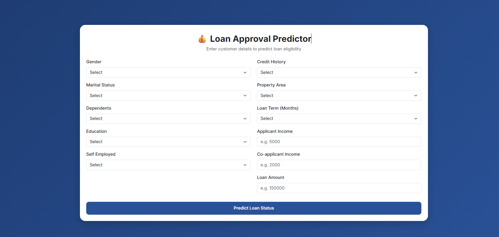

# 🚀 Loan Status Prediction

## 📌 Project Overview

Financial institutions receive thousands of loan applications and must decide whether to approve or reject each applicant based on financial, demographic, and credit-related information. This process is often time-consuming and subject to human bias.

This project focuses on building a **machine learning-based decision support system** that predicts whether a loan application will be approved or rejected. The goal is to improve efficiency, reduce risk, and support data-driven lending decisions.

The project follows a full ML pipeline:
- Data cleaning and preprocessing
- Exploratory Data Analysis (EDA)
- Feature engineering
- Model training and comparison
- Hyperparameter tuning
- Threshold optimization
- Deployment using Flask

---

## 📊 Problem Statement

The objective of this project is to analyze loan application data and build a classification model that predicts whether a loan will be approved (`Y`) or rejected (`N`).

The system learns patterns from applicant information such as income, credit history, education, and property location to make predictions.

This is a **binary classification problem**.

---

## 📂 Dataset

Dataset source:
[Loan Status Dataset](https://storage.googleapis.com/kaggle-data-sets/15953/21070/bundle/archive.zip)

### Dataset Description

Each row represents a loan application containing applicant demographic, financial, and credit-related information.

### Features

| Feature | Description | Data Type |
|---|---|---|
| `Loan_ID` | Unique loan application ID | Categorical |
| `Gender` | Gender of the applicant | Categorical |
| `Married` | Marital status | Categorical |
| `Dependents` | Number of dependents | Ordinal Categorical |
| `Education` | Education level | Categorical |
| `Self_Employed` | Self-employment status | Categorical |
| `ApplicantIncome` | Applicant income | Numerical |
| `CoapplicantIncome` | Co-applicant income | Numerical |
| `LoanAmount` | Requested loan amount | Numerical |
| `Loan_Amount_Term` | Loan repayment duration | Numerical |
| `Credit_History` | Credit history (0/1) | Binary |
| `Property_Area` | Location of property | Categorical |
| `Loan_Status` | Loan approval status | Target |

---

## 🎯 Target Variable

| Value | Meaning |
|---|---|
| `Y` | Loan Approved |
| `N` | Loan Rejected |

This is a **binary classification task**.

---

## 📏 Evaluation Metric

This project prioritizes **F1-score** as the main evaluation metric.

### Why F1-score?

Loan approval systems must balance:

- ❌ False Positives → Approving risky loans (financial loss)
- ❌ False Negatives → Rejecting qualified applicants (lost business)

Since both errors are important, accuracy alone is not sufficient.

### Metrics used:
- F1-score (Primary metric)
- Precision
- Recall
- Accuracy
- ROC-AUC
- Confusion Matrix

---

## 🔄 Workflow

### 1. Data Pipeline

- Load dataset
- Clean data using preprocessing function
- Handle missing values
- Encode categorical variables
- Feature engineering

### 2. Data Cleaning Function

```python
def clean_data(data: pd.DataFrame, drop_missing: bool = False) -> pd.DataFrame:
    """
    Cleans raw loan dataset by:
    - Standardizing column names
    - Dropping duplicates
    - Type casting
    - Encoding target variable
    - Standardizing categorical variables
    - Optionally removing missing values
    """

    data.columns = data.columns.str.replace("_", "")
    data = data.drop(columns=["LoanID"])
    data = data.drop_duplicates()

    data["CreditHistory"] = data["CreditHistory"].astype("category")

    for column in data.select_dtypes(include=["object"]).columns:
        data[column] = data[column].str.title()

    data["LoanStatus"] = data["LoanStatus"].map(
        lambda x: "Yes" if x == "Y" else "No"
    )

    if drop_missing:
        data = data.dropna().reset_index(drop=True)

    return data
```

### 3. Exploratory Data Analysis (EDA)
- Missing value analysis
- Distribution analysis
- Outlier detection
- Feature relationships
- Target variable analysis

### 4. Model Training

Models evaluated:
- Logistic Regression
- Support Vector Classifier
- Decision Tree
- Random Forest
- KNN
- CatBoost
- XGBoost

Evaluation method:
- Cross-validation (F1-score)

### 5. Model Tuning
- RandomizedSearchCV for hyperparameter tuning
- F1-score used as optimization metric
- Top models selected for further tuning

### 6. Threshold Optimization
- Probability threshold tuning to improve F1-score
- Selection of optimal classification cutoff

### 7. Final Model Selection
Final model selected (Logistic Regression) based on:
- F1-score (primary)
- ROC-AUC
- Precision-recall balance
- Stability across validation folds
- Training time
- Interpretation

---
## 📈 Final Test Results
```json
{
  "accuracy": 0.8618,
  "precision": 0.84,
  "recall": 0.9882,
  "f1": 0.9081,
  "roc_auc": 0.7836
}
```

---
## 🚀 Deployment

The final model is deployed using Flask.

### Features:
- /predict endpoint (Port 5000)
- Web-based UI for testing predictions

- Input validation
- Real-time inference

---
## ▶️ How to Run
### 1. Clone repository
```bash
git clone <repo-url>
cd loan-status-prediction
```

### 2. Install dependencies
```bash
pip install -r requirements-dev.txt
pip install -r requirements.txt
```

### 3. Train model (optional)
```bash
python train.py
```

### 4. Run Flask app
```bash
python app.py
```
### 5. Open browser
`http://localhost:5000`

---
## 🧪 Testing

You can test the model using:

- data/test/test_features.csv
- data/test/test_labels.csv
- Compare predictions with actual labels for evaluation.

---
## 📌 Key Highlights
- End-to-end ML pipeline
- Proper metric selection (F1-score)
- Multiple model comparison
- Hyperparameter tuning with RandomizedSearchCV
- Threshold optimization
- Production-ready Flask deployment

---
## 👨‍💻 Tech Stack
- Python
- Pandas, NumPy
- Scikit-learn
- CatBoost, XGBoost
- Flask
- Matplotlib, Seaborn

---
## 📜 License

This project is for educational and portfolio purposes.

---
## ✨ Author

Built as a machine learning project for loan approval prediction and model optimization practice.